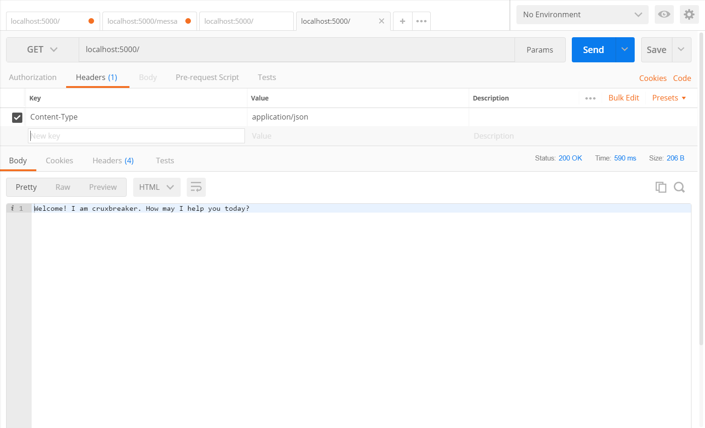
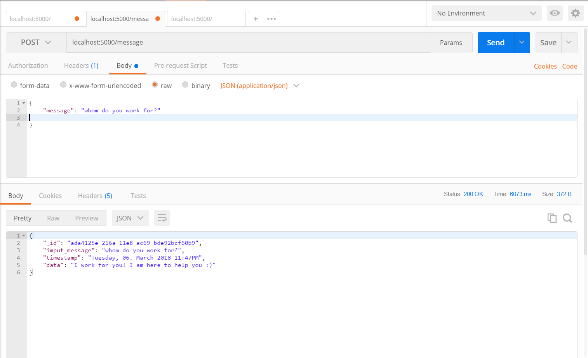

# The Deep Learning Chat bot

A simple bot made using NLP, Seq2Seq and Deep Learning using Tensorflow.


## Prerequisites

1. Python 3 ([**Anaconda**](https://www.anaconda.com/download/) Recommended)
2. [**Tensorflow**](https://www.tensorflow.org/) 0.12.1
3. **Flask** 0.12.2
4. [**Postman**](https://www.getpostman.com/apps)

## Simple Steps to run this repo

1. Clone this repo using git bash or download the [.zip](https://github.com/knaxus/the-deeplearning-bot/archive/master.zip) file and extract it.

2. [Download](https://drive.google.com/open?id=1FS5vyP1yjaI2iE4_YUfE1ybacbM5bRsi) the pre-trained weight folder and place it inside the source folder.

3. Create a new environment using bash (in Mac) or anaconda prompt (in windows)

   ``conda create -n deeplearning-bot pyhton=3.6 anaconda``

4. Install Tensorflow and Flask.

   `pip install tensorflow=0.12.1 && pip install flask`

5. cd into the chat bot directory *./the-deeplearning-bot/api* and run:

   `pyhton api.py`

6. Open Postman

   **GET 127.0.0.1:5000/** 

   

   ​

   **POST 127.0.0.1:5000/message**


##Usage 

1. Install [curl](https://curl.haxx.se/download.html)

2. run the following commands:

   `curl http://127.0.0.1:5000/`

   `curl -H "Content-type: application/json" -X POST http://127.0.0.1:5000/message -d '{"message":"Hello Data"}'`


## Contribution

Feel free to for this repo and make changes and explore it. You can add new features to this bot. Always open for feedbacks and upgrade. ;)


## Credits

This bot is inspired from [Suriyadeepan's practical_seq2seq](https://github.com/suriyadeepan/practical_seq2seq)


## License

The MIT License

Copyright (c) 2018 [Cruxbreaker](https://github.com/cruxbreaker).

```
Permission is hereby granted, free of charge, to any person obtaining a copy
of this software and associated documentation files (the "Software"), to deal
in the Software without restriction, including without limitation the rights
to use, copy, modify, merge, publish, distribute, sublicense, and/or sell
copies of the Software, and to permit persons to whom the Software is
furnished to do so, subject to the following conditions:

The above copyright notice and this permission notice shall be included in
all copies or substantial portions of the Software.

THE SOFTWARE IS PROVIDED "AS IS", WITHOUT WARRANTY OF ANY KIND, EXPRESS OR
IMPLIED, INCLUDING BUT NOT LIMITED TO THE WARRANTIES OF MERCHANTABILITY,
FITNESS FOR A PARTICULAR PURPOSE AND NONINFRINGEMENT. IN NO EVENT SHALL THE
AUTHORS OR COPYRIGHT HOLDERS BE LIABLE FOR ANY CLAIM, DAMAGES OR OTHER
LIABILITY, WHETHER IN AN ACTION OF CONTRACT, TORT OR OTHERWISE, ARISING FROM,
OUT OF OR IN CONNECTION WITH THE SOFTWARE OR THE USE OR OTHER DEALINGS IN
THE SOFTWARE.
```